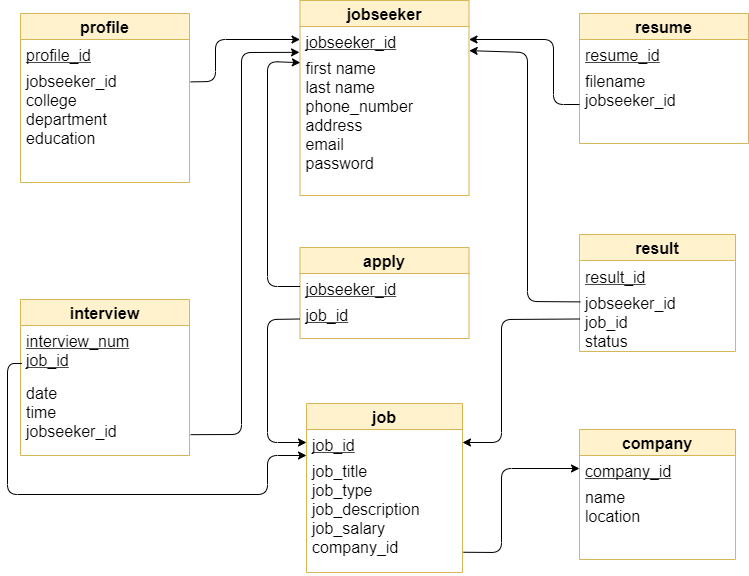
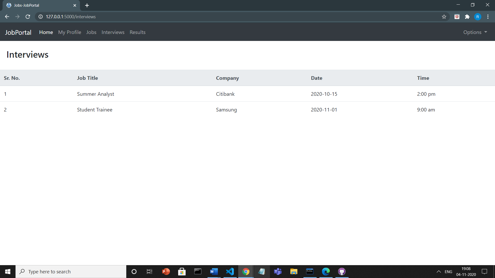

# Online-JobPortal
Database Management System Course Project

<pre>
Rishabh Agarwal
MIS - 111807069
TY Computer Engineering
Division - 2
</pre>

### Project Description - 
As more companies are recruiting students for jobs virtually, there is a need for an online Job Portal to connect both job seekers and companies for the recruitment process. The Job Portal application will keep records of the companies and jobseekers and allow users to search and apply for jobs offered by different companies. Various features like creating and managing profile, uploading resume, checking interview schedules and results would help bridge the gap between job seekers and recruiters.

### Technologies Used - 
<pre>
Frontend - HTML, CSS, Bootstrap, JS
Backend - Flask (Python)
Database - MySQL
</pre>

### Features - 
<ul>
  <li>Job seekers will be able to register and login to the portal.</li>
  <li>Job seekers can create and update their profile by entering their academic details.</li>
  <li>Job seekers would also be able to upload their resume on the website.</li>
  <li>Job seekers can search and apply for multiple job vacancies offered by various companies. They can see all the details for a particular job on the website.</li>
  <li>Applicants will be able to view their schedule for interviews on the portal.</li>
  <li>Applicants can see their result status for a particular company’s job profile.</li>
  <li>Job seekers can view their account details and account summary</li>
</ul>

# ER Diagram - 

# Relational Schema - 

# Installation Guide - 
1. Clone the repository
2. Install Flask and flask-mysqldb using 
<pre>
pip install flask
pip install flask-mysqldb
</pre>
3. Run the application using
<pre>
python app.py
</pre>

# Web Pages - 

1. Signup 

2. Login 

3. Home 

4. Profile Details

5. Jobs

6. Interviews

7. Results

8. Account Details

